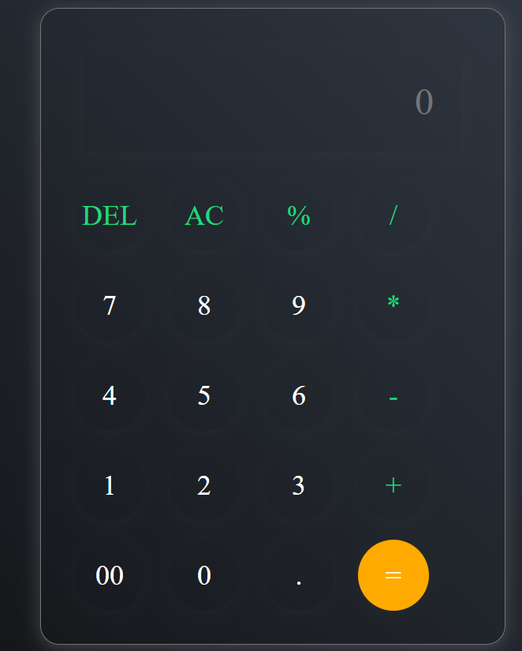
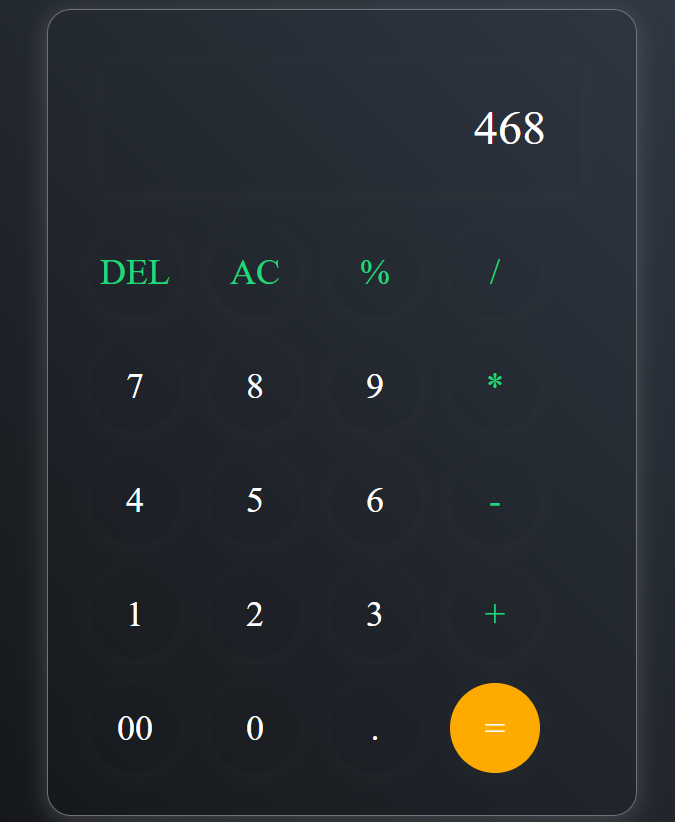

# Simple Calculator (Vanilla JavaScript)

A small browser-based calculator built with HTML, CSS, and JavaScript for basic arithmetic and simple editing (AC, DEL, =).

## Images

    

## Files

- [index.html](index.html) — markup and calculator layout
- [script.js](script.js) — event handling and calculation logic (uses `eval`)
- [style.css](style.css) — styles and layout

## Setup

- Run: Open [index.html](index.html) in any modern browser.
- No build tools or external dependencies required.

## Usage

- Click digits and operators to build an expression.
- Press `=` to evaluate the expression.
- Press `AC` to clear the input.
- Press `DEL` to delete the last character.
- The expression and result appear in the input controlled by the script.

## Notes

- Security: `eval` is used in [script.js](script.js). Avoid exposing this app to untrusted input. For production, replace `eval` with a safe parser (e.g., `mathjs`) or implement a proper expression evaluator.
- Suggestions: add keyboard support, decimal/parentheses handling, input validation, and accessibility improvements (ARIA, focus management).

## License

free to use and adapt for learning and personal projects.
